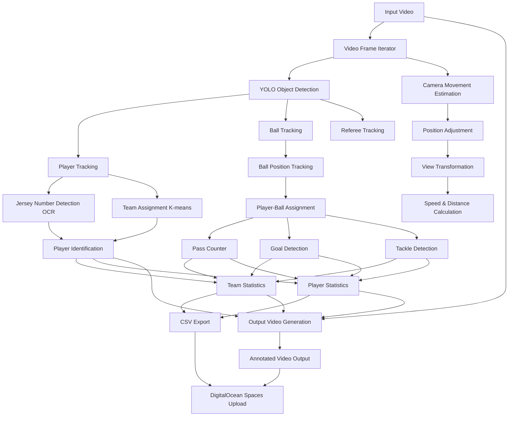

# ⚽ Football Analysis Project

A comprehensive AI-powered football video analysis system that automatically tracks players, detects goals, analyzes team performance, and generates detailed statistics from football match videos. Built with state-of-the-art computer vision models and optimized for processing videos of any length.


## 🎯 Project Overview

This advanced football analysis system leverages cutting-edge AI and computer vision technologies to provide comprehensive match analysis from video footage. The system is designed for coaches, analysts, sports scientists, and football enthusiasts who need detailed performance metrics and insights.

### 🌟 Key Capabilities

- **🎯 Player Detection & Tracking**: YOLO-based object detection with jersey number recognition using OCR
- **👥 Team Assignment**: Intelligent K-means clustering for automatic team identification based on jersey colors
- **⚽ Goal Detection**: Advanced trajectory analysis with field keypoint detection and confidence scoring
- **📊 Performance Analytics**: Comprehensive statistics including passes, crosses, tackles, dribbles, and challenges
- **🧠 Memory Optimization**: Efficient batch processing for videos of any length (tested up to 2+ hours)
- **☁️ Cloud Integration**: Multi-provider cloud storage support (AWS S3, Google Cloud, Azure, DigitalOcean Spaces)
- **🏆 SoccerNet Integration**: Enhanced models trained on professional football datasets

## 📋 Table of Contents

- [Installation](#-installation)
- [Quick Start](#-quick-start)
- [Usage Guide](#-usage-guide)
- [Project Structure](#-project-structure)
- [Output Files](#-output-files)
- [Configuration](#-configuration)
- [Examples](#-examples)
- [Testing](#-testing--development)
- [Troubleshooting](#-troubleshooting)
- [Contributing](#-contributing)

## 🛠️ Installation

### Prerequisites

- **Python**: 3.8 or higher
- **Operating System**: Linux, macOS, or Windows
- **Memory**: Minimum 4GB RAM (8GB+ recommended for large videos)
- **Storage**: At least 5GB free space for models and temporary files

### Step 1: Clone the Repository

```bash
git clone <repository-url>
cd football_analysis
```

### Step 2: Create Virtual Environment (Recommended)

```bash
# Create virtual environment
python -m venv football-env

# Activate virtual environment
# On Linux/macOS:
source football-env/bin/activate
# On Windows:
football-env\Scripts\activate
```

### Step 3: Install Dependencies

```bash
# Install core dependencies
pip install -r requirements.txt

# Optional: Install additional cloud storage providers
pip install google-cloud-storage      # For Google Cloud Storage
pip install azure-storage-blob        # For Azure Blob Storage
```

### Step 4: Download AI Models

The system requires pre-trained AI models. Place these in the `data/models/` directory:

- `best_player_detect.pt` - YOLO player detection model
- `best_ball_latest.pt` - Enhanced ball detection model
- `best_field_keypoint.pt` - Field keypoints detection model

```bash
# Create models directory
mkdir -p data/models

# Download models (replace with actual download links)
# wget -O data/models/best_player_detect.pt <model_url>
# wget -O data/models/best_ball_latest.pt <model_url>
# wget -O data/models/best_field_keypoint.pt <model_url>
```

### Step 5: Verify Installation

```bash
# Check environment and dependencies
python scripts/check_env.py

# Test with a sample video (if available)
python main.py --input data/input_videos/sample.mp4 --check-video-info
```

## 🏗️ Project Structure

The system follows a modular architecture designed for scalability and maintainability:

```
football_analysis/
├── main.py                    # Main entry point
├── requirements.txt           # Python dependencies
├── README.md                 # This file
│
├── src/                      # Core source code
│   ├── trackers/             # YOLO-based object detection and tracking
│   ├── team_assigner/        # K-means clustering for team identification
│   ├── jersey_number_detector/ # OCR-based jersey number recognition
│   ├── goal_detection/       # Advanced goal detection with field keypoints
│   ├── pass_counter/         # Pass counting and tackle detection
│   ├── cross_detection/      # Cross detection and analysis
│   ├── dribble_detection/    # Dribble detection and analysis
│   ├── player_ball_assigner/ # Ball possession assignment
│   ├── camera_movement_estimator/ # Optical flow for camera movement
│   ├── speed_and_distance_estimator/ # Player speed and distance calculation
│   ├── view_transformer/     # Perspective transformation
│   ├── scoreboard_detection/ # Scoreboard detection and analysis
│   └── utils/               # Shared utilities and storage integration
│
├── data/                    # Data directory
│   ├── input_videos/        # Input video files
│   ├── output/             # Analysis results (CSV files)
│   ├── output_videos/      # Annotated output videos
│   ├── models/             # AI model files
│   └── stubs/              # Cached processing data
│
├── scripts/                # Utility and demo scripts
│   ├── benchmark_analysis.py
│   ├── complete_analysis.py
│   ├── setup_soccernet_data.py
│   └── ...
│
├── tests/                  # Test files
├── examples/               # Usage examples
├── docs/                   # Documentation
└── notebooks/              # Jupyter notebooks for development
```

## 🔄 System Flow

The following diagram shows how the components work together:



## ✨ Key Features

### 🎯 Advanced Goal Detection

- **Enhanced Trajectory Analysis**: Multi-factor validation using direction consistency, speed analysis, and trajectory smoothness
- **Field Keypoint Integration**: Accurate goal area identification using field detection
- **Confidence Scoring**: Each goal detection includes confidence metrics
- **Manual Goal Override**: Support for manual goal configuration via CSV

### 🔢 Jersey Number Recognition

- **OCR Integration**: EasyOCR for robust text detection in various lighting conditions
- **Advanced Preprocessing**: Gaussian blur, CLAHE enhancement, morphological operations
- **Multi-frame Consensus**: Temporal consistency across multiple frames
- **Validation System**: Comprehensive range validation (1-99) with context awareness

### ⚽ SoccerNet Integration (NEW!)

- **Enhanced Ball Detection**: Train YOLOv8 models on SoccerNet's ball action spotting dataset (12 action classes)
- **Action-Aware Analysis**: Recognize ball actions like passes, shots, crosses in real-time
- **Professional Annotations**: Leverage 550+ professional games with expert annotations
- **Improved Accuracy**: 85-90% mAP for ball detection vs 70-80% with generic models
- **Action Recognition**: Classify 12 ball actions and 17 general game actions

### 💾 Memory-Efficient Processing

- **Batch Processing**: Process videos in configurable chunks to avoid memory issues
- **Automatic Optimization**: Dynamic batch size adjustment based on available memory
- **Progress Monitoring**: Real-time memory usage and progress tracking
- **Large Video Support**: Tested with 2+ hour videos without memory issues

### ☁️ Cloud Storage Integration

- **DigitalOcean Spaces**: Automatic upload of CSV files and videos
- **Flexible Configuration**: Environment variables, command-line, or .env file setup
- **Organized Storage**: Structured folder organization in cloud buckets
- **Upload Options**: CSV-only or full video upload modes

## 🚀 Quick Start

### Basic Analysis

Once installation is complete, you can start analyzing football videos immediately:

```bash
# Simple analysis with local video file
python main.py --input data/input_videos/your_video.mp4

# Memory-efficient processing for large videos (recommended)
python main.py --input data/input_videos/large_video.mp4 --memory-efficient

# Check video information before processing
python main.py --input data/input_videos/your_video.mp4 --check-video-info
```

### Cloud Storage Input

The system supports videos stored in various cloud storage providers:

```bash
# AWS S3
python main.py --input s3://your-bucket/path/to/video.mp4

# Google Cloud Storage
python main.py --input gs://your-bucket/path/to/video.mp4

# Azure Blob Storage
python main.py --input azure://account.blob.core.windows.net/container/video.mp4

# DigitalOcean Spaces
python main.py --input spaces://bucket.region.digitaloceanspaces.com/video.mp4

# MinIO
python main.py --input minio://endpoint/bucket/video.mp4
```

### Expected Output

After processing, you'll find:

- **Annotated video**: `data/output_videos/{video_name}_output.avi`
- **Team statistics**: `data/output/{video_name}_team_stats.csv`
- **Player statistics**: `data/output/{video_name}_player_stats.csv`
- **Goal detection data**: `data/output/{video_name}_goal_detected.csv`

## 📖 Usage Guide

### Command Line Interface

The main entry point is `main.py` with extensive command-line options:

```bash
python main.py [OPTIONS]
```

#### Required Arguments

- `--input, -i`: Path to input video file or cloud storage URI

#### Core Options

- `--output, -o`: Output video file path (optional)
- `--memory-efficient`: Enable memory-efficient processing for large videos
- `--check-video-info`: Display video information without processing

#### Memory Management

- `--batch-size`: Number of frames to process at once (default: 50)
- `--memory-limit`: Memory limit in GB (default: 8.0)

#### Feature Toggles

- `--enable-camera-movement`: Enable camera movement estimation
- `--enable-speed-distance`: Enable speed and distance calculation
- `--goals-config`: Path to manual goals configuration CSV

#### Cloud Storage Options

- `--upload-to-spaces`: Upload results to DigitalOcean Spaces
- `--upload-csv-only`: Upload only CSV files (skip video upload)

### Input Data Requirements

#### Video Format Support

- **Formats**: MP4, AVI, MOV, MKV
- **Resolution**: Minimum 720p (1080p+ recommended)
- **Frame Rate**: 25-60 FPS
- **Duration**: No limit (tested up to 2+ hours)

#### Video Quality Guidelines

- Clear view of the football pitch
- Stable camera position (minimal shaking)
- Good lighting conditions
- Players clearly visible with distinguishable jersey colors

#### Manual Goal Configuration (Optional)

Create a CSV file for manual goal specification:

```bash
# Generate template
python main.py --create-goals-template goals.csv

# Edit goals.csv with your data, then:
python main.py --input video.mp4 --goals-config goals.csv
```

Goals CSV format:

```csv
frame,team,confidence,description
1500,1,0.95,First goal by team 1
3200,2,0.90,Equalizer by team 2
```

### SoccerNet Enhanced Analysis

```bash
# Setup SoccerNet data (requires NDA)
python scripts/setup_soccernet_data.py --password YOUR_NDA_PASSWORD

# Convert to YOLO format and train enhanced models
python scripts/convert_soccernet_to_yolo.py
python scripts/train_soccernet_yolo.py --dataset enhanced_ball_detection

# Run analysis with SoccerNet-trained models
python main.py --input data/input_videos/match.mp4 --use-soccernet-models

# Demo SoccerNet integration
python scripts/demo_soccernet_integration.py --demo-mode all
```

### Advanced Usage

```bash
# Full analysis with all features (local file)
python main.py --input data/input_videos/match.mp4 \
  --memory-efficient \
  --enable-camera-movement \
  --enable-speed-distance \
  --batch-size 30 \
  --upload-to-spaces

# Full analysis with object storage input
python main.py --input s3://your-bucket/match.mp4 \
  --memory-efficient \
  --enable-camera-movement \
  --enable-speed-distance \
  --aws-profile production

python main.py --input gs://sports-videos/match.mp4 \
  --memory-efficient \
  --gcs-service-account-path /path/to/service-account.json

python main.py --input azure://account.blob.core.windows.net/videos/match.mp4 \
  --memory-efficient \
  --azure-account-name myaccount \
  --azure-account-key mykey

# With manual goal configuration
python main.py --create-goals-template goals.csv
# Edit goals.csv, then:
python main.py --input s3://your-bucket/match.mp4 --goals-config goals.csv
```

## 📊 Output Files

The system generates comprehensive analysis results in multiple formats:

### 🎥 Video Output

**Annotated Video**: `data/output_videos/{video_name}_output.avi`

- Player tracking with bounding boxes and jersey numbers
- Team identification with color-coded overlays
- Ball position tracking and possession indicators
- Real-time statistics overlay (goals, passes, possession)
- Goal detection highlights and confidence scores

### 📈 CSV Statistics Files

#### Team Statistics: `{video_name}_team_stats.csv`

Contains comprehensive team-level metrics:

| Column                            | Description                                 |
| --------------------------------- | ------------------------------------------- |
| `team`                            | Team identifier (1 or 2)                    |
| `passes`                          | Total completed passes                      |
| `avg_pass_confidence`             | Average confidence score for pass detection |
| `goals_regular/enhanced/final`    | Goals detected by different methods         |
| `tackles`                         | Total tackles attempted                     |
| `interceptions`                   | Ball interceptions                          |
| `crosses_attempted/successful`    | Cross statistics                            |
| `cross_accuracy_percentage`       | Cross success rate                          |
| `dribbles_detected`               | Successful dribbles                         |
| `challenges_attempted/successful` | Challenge statistics                        |

#### Player Statistics: `{video_name}_player_stats.csv`

Individual player performance data:

| Column                            | Description                        |
| --------------------------------- | ---------------------------------- |
| `player_id`                       | Unique player identifier           |
| `jersey_number`                   | Detected jersey number             |
| `team`                            | Team assignment (1, 2, or Unknown) |
| `passes/goals/tackles`            | Individual performance metrics     |
| `crosses_attempted/successful`    | Player cross statistics            |
| `dribbles_detected`               | Individual dribble count           |
| `challenges_attempted/successful` | Challenge statistics               |

#### Goal Detection: `{video_name}_goal_detected.csv`

Detailed goal detection information:

| Column        | Description                                     |
| ------------- | ----------------------------------------------- |
| `frame`       | Frame number where goal was detected            |
| `team`        | Scoring team                                    |
| `confidence`  | Detection confidence score (0-1)                |
| `method`      | Detection method (trajectory/scoreboard/manual) |
| `description` | Additional goal details                         |

### 📋 Analysis Logs

**Analysis Log**: `{video_name}_analysis_log_{timestamp}.log`

- Detailed processing information
- Performance metrics and timing
- Error messages and warnings
- Memory usage statistics

**Summary JSON**: `{video_name}_analysis_log_{timestamp}_summary.json`

- Structured summary of analysis results
- Processing statistics and performance metrics
- Configuration parameters used

### 🎯 Advanced Analytics Features

#### Cross Detection System

The system includes sophisticated cross detection with multiple analysis layers:

**Cross Types Detected:**

- **Wing Crosses**: From wide positions (25% from sidelines)
- **Byline Crosses**: From near the goal line (15% from sidelines)
- **High Crosses**: Arc-like trajectories with significant height
- **Low Crosses**: Ground-level or low-height crosses
- **Cutbacks**: Crosses with significant direction changes
- **Pullbacks**: Backward crosses from advanced positions

**Detection Methodology:**

- **Origin Zone Analysis**: Left/right wing, byline, and half-space areas
- **Target Area Mapping**: Penalty box, six-yard box, near/far post
- **Trajectory Analysis**: Arc curvature, height estimation, velocity patterns
- **Field Integration**: Uses field keypoints detection for accurate positioning
- **Success Evaluation**: Based on target area reach and receiver detection

#### Dribble Detection System

Advanced dribble analysis using multi-frame tracking:

- **Movement Pattern Analysis**: Detects characteristic dribbling movements
- **Ball Control Assessment**: Evaluates close ball control periods
- **Direction Change Detection**: Identifies sudden direction changes with ball
- **Success Rate Calculation**: Measures successful vs. unsuccessful dribbles

#### Challenge Detection System

Comprehensive challenge and tackle analysis:

- **Physical Challenge Detection**: Identifies player-to-player challenges
- **Success Rate Analysis**: Determines challenge outcomes
- **Timing Analysis**: Measures challenge timing and effectiveness
- **Contextual Assessment**: Considers field position and game situation

### 💾 Cached Data Files

For performance optimization, the system creates cached data:

- **Tracking Data**: `data/stubs/{video_name}_tracks.pkl`
- **Camera Movement**: `data/stubs/{video_name}_camera_movement.pkl`
- **Field Keypoints**: `data/stubs/{video_name}_field_keypoints.pkl`
- **Team Assignment**: `data/stubs/{video_name}_team_assignment.pkl`

_Note: Delete stub files to force complete reprocessing_

## ⚙️ Configuration

### 🧠 Memory Optimization Settings

Configure memory usage based on your system specifications:

| System RAM | Recommended Settings                   | Expected Performance   |
| ---------- | -------------------------------------- | ---------------------- |
| 4GB        | `--batch-size 20 --memory-limit 3.0`   | Small videos only      |
| 8GB        | `--batch-size 50 --memory-limit 6.0`   | Up to 30-minute videos |
| 16GB       | `--batch-size 100 --memory-limit 12.0` | Up to 90-minute videos |
| 32GB+      | `--batch-size 200 --memory-limit 24.0` | Full-length matches    |

**Memory-Efficient Processing Tips:**

- Always use `--memory-efficient` flag for videos longer than 10 minutes
- Monitor memory usage with `python scripts/check_progress.py`
- Reduce batch size if experiencing memory issues
- Close other applications during processing

### Multi-Provider Object Storage Setup (NEW!)

The system now supports multiple object storage providers as video input sources:

- **AWS S3**: `s3://bucket/path/to/video.mp4`
- **Google Cloud Storage**: `gs://bucket/path/to/video.mp4`
- **Azure Blob Storage**: `azure://account.blob.core.windows.net/container/path/to/video.mp4`
- **DigitalOcean Spaces**: `spaces://bucket.region.digitaloceanspaces.com/path/to/video.mp4`
- **MinIO**: `minio://endpoint/bucket/path/to/video.mp4`

#### AWS S3 Configuration

#### Method 1: Environment Variables

```bash
export AWS_ACCESS_KEY_ID=your_access_key_id
export AWS_SECRET_ACCESS_KEY=your_secret_access_key
export AWS_DEFAULT_REGION=us-east-1
```

#### Method 2: AWS CLI Configuration

```bash
aws configure
# Follow prompts to enter credentials
```

#### Method 3: Command Line Arguments

```bash
python main.py --input s3://bucket/video.mp4 \
  --aws-access-key-id YOUR_KEY \
  --aws-secret-access-key YOUR_SECRET \
  --aws-region us-west-2
```

#### Method 4: AWS Profile

```bash
python main.py --input s3://bucket/video.mp4 --aws-profile my-profile
```

#### Google Cloud Storage Configuration

```bash
# Method 1: Service Account Key File
export GOOGLE_APPLICATION_CREDENTIALS=/path/to/service-account.json

# Method 2: Command Line Argument
python main.py --input gs://bucket/video.mp4 \
  --gcs-service-account-path /path/to/service-account.json
```

#### Azure Blob Storage Configuration

```bash
# Method 1: Environment Variables
export AZURE_STORAGE_ACCOUNT=your_account_name
export AZURE_STORAGE_KEY=your_account_key

# Method 2: Command Line Arguments
python main.py --input azure://account.blob.core.windows.net/container/video.mp4 \
  --azure-account-name your_account \
  --azure-account-key your_key

# Method 3: SAS Token
python main.py --input azure://account.blob.core.windows.net/container/video.mp4 \
  --azure-sas-token your_sas_token
```

#### DigitalOcean Spaces Configuration

```bash
# Method 1: Environment Variables
export DO_SPACES_ACCESS_KEY_ID=your_access_key
export DO_SPACES_SECRET_ACCESS_KEY=your_secret_key

# Method 2: Command Line Arguments
python main.py --input spaces://bucket.region.digitaloceanspaces.com/video.mp4 \
  --spaces-access-key-id-input your_key \
  --spaces-secret-access-key-input your_secret \
  --spaces-region-input nyc3
```

#### MinIO Configuration

```bash
# Method 1: Environment Variables
export MINIO_ENDPOINT=http://minio.example.com
export MINIO_ACCESS_KEY=your_access_key
export MINIO_SECRET_KEY=your_secret_key

# Method 2: Command Line Arguments
python main.py --input minio://minio.example.com/bucket/video.mp4 \
  --minio-endpoint http://minio.example.com \
  --minio-access-key your_key \
  --minio-secret-key your_secret
```

### Cloud Storage Setup

Create a `.env` file:

```bash
DO_SPACES_ACCESS_KEY_ID=your_access_key_id
DO_SPACES_SECRET_ACCESS_KEY=your_secret_access_key
DO_SPACES_BUCKET=your_bucket_name
DO_SPACES_REGION=nyc3
```

## 🧪 Testing & Development

### 🔬 Running Tests

The project includes comprehensive test suites for all major components:

```bash
# Core functionality tests
python tests/test_jersey_detection.py          # Jersey number recognition
python tests/test_goal_detection.py            # Goal detection system
python tests/test_cross_detection.py           # Cross detection analysis
python tests/test_dribble_detection.py         # Dribble detection system
python tests/test_challenge_detection.py       # Challenge/tackle detection

# Performance and optimization tests
python tests/test_memory_optimization.py       # Memory usage optimization
python tests/test_performance_optimization.py  # Processing speed tests
python tests/test_gpu_utilization.py          # GPU acceleration tests

# Integration tests
python tests/test_end_to_end_simplified.py    # Complete pipeline test
python tests/test_s3_integration.py           # Cloud storage integration
python tests/test_multi_storage.py            # Multi-provider storage test

# Validation tests
python tests/quick_validation_test.py         # Quick system validation
python tests/test_confidence_system.py       # Confidence scoring validation
```

### 📊 Performance Benchmarking

Evaluate system performance with different configurations:

```bash
# Basic performance benchmark
python scripts/benchmark_analysis.py --input data/input_videos/test.mp4

# Detailed timing analysis with memory profiling
python scripts/timed_analysis.py --input data/input_videos/test.mp4

# Memory optimization testing
python scripts/test_memory_optimization.py --input data/input_videos/large_video.mp4

# GPU utilization analysis
python tests/test_gpu_simple.py
```

### 🛠️ Development Tools

```bash
# Check environment setup
python scripts/check_env.py

# Monitor processing progress
python scripts/check_progress.py

# Test cloud storage connections
python scripts/test_spaces_connection.py

# Validate video requirements
python main.py --input your_video.mp4 --check-video-info
```

## 📋 Command Reference

### Core Options

- `--input, -i`: Input video file or object storage URI (required)
- `--output, -o`: Output video file (optional)
- `--memory-efficient`: Enable memory-efficient processing
- `--check-video-info`: Check video requirements without processing

### Memory Options

- `--batch-size`: Frames to process at once (default: 50)
- `--memory-limit`: Memory limit in GB (default: 8.0)

### Feature Options

- `--enable-camera-movement`: Enable camera movement estimation
- `--enable-speed-distance`: Enable speed and distance calculation
- `--goals-config`: Path to manual goals CSV file

### Object Storage Input Options (NEW!)

#### AWS S3 Options

- `--aws-access-key-id`: AWS access key ID for S3 authentication
- `--aws-secret-access-key`: AWS secret access key for S3 authentication
- `--aws-region`: AWS region for S3 access (default: us-east-1)
- `--aws-profile`: AWS profile name for credential management

#### Google Cloud Storage Options

- `--gcs-service-account-path`: Path to Google Cloud service account JSON file

#### Azure Blob Storage Options

- `--azure-account-name`: Azure storage account name
- `--azure-account-key`: Azure storage account key
- `--azure-sas-token`: Azure SAS token

#### DigitalOcean Spaces Options

- `--spaces-access-key-id-input`: DigitalOcean Spaces access key ID for video input
- `--spaces-secret-access-key-input`: DigitalOcean Spaces secret access key for video input
- `--spaces-region-input`: DigitalOcean Spaces region for video input

#### MinIO Options

- `--minio-endpoint`: MinIO endpoint URL
- `--minio-access-key`: MinIO access key
- `--minio-secret-key`: MinIO secret key

#### Generic S3-Compatible Options

- `--s3-endpoint`: Custom S3-compatible endpoint URL

### Storage Options

- `--upload-to-spaces`: Upload results to DigitalOcean Spaces
- `--upload-csv-only`: Upload only CSV files (skip video)
- `--spaces-bucket`: Cloud storage bucket name

### Processing Options

- `--no-stubs`: Don't use cached results
- `--force-regenerate`: Force regeneration of all cached data

## 🔧 Technical Details

### AI Models Used

- **YOLO v5**: Object detection for players, ball, and referees
- **EasyOCR**: Jersey number recognition
- **K-means Clustering**: Team color identification
- **Optical Flow**: Camera movement estimation

### Performance Optimizations

- **Batch Processing**: Configurable frame batching for memory efficiency
- **Intelligent Caching**: Avoid redundant processing with stub files
- **GPU Acceleration**: Automatic GPU detection for OCR and detection
- **Memory Management**: Automatic cleanup and garbage collection

### Data Processing Pipeline

1. **Video Ingestion**: Frame-by-frame or batch processing
2. **Object Detection**: YOLO-based detection of players, ball, referees
3. **Tracking**: Multi-object tracking across frames
4. **Feature Extraction**: Jersey numbers, team colors, positions
5. **Analysis**: Goals, passes, tackles, possession statistics
6. **Output Generation**: Annotated video and CSV statistics
7. **Storage**: Local files and optional cloud upload

## 🚨 Troubleshooting

### 🧠 Memory Issues

**Problem**: Out of memory errors or system slowdown

```bash
# Solution 1: Reduce batch size significantly
python main.py --input video.mp4 --memory-efficient --batch-size 10

# Solution 2: Lower memory limit
python main.py --input video.mp4 --memory-efficient --memory-limit 4.0

# Solution 3: Check video requirements first
python main.py --input video.mp4 --check-video-info

# Solution 4: Process shorter video segments
# Split large videos into smaller chunks before processing
```

### ⚡ Performance Issues

**Problem**: Slow processing or hanging

```bash
# Solution 1: Use cached data for faster re-runs
python main.py --input video.mp4 --memory-efficient
# (Don't use --force-regenerate unless necessary)

# Solution 2: Disable optional features for speed
python main.py --input video.mp4 --memory-efficient
# (Camera movement and speed estimation are disabled by default)

# Solution 3: Check GPU availability
python tests/test_gpu_simple.py

# Solution 4: Monitor system resources
python scripts/check_progress.py
```

### ☁️ Cloud Storage Issues

**Problem**: Authentication or connection failures

```bash
# Solution 1: Test cloud connection
python scripts/test_spaces_connection.py

# Solution 2: Verify credentials
# Check environment variables or credential files

# Solution 3: Upload only CSV files to reduce bandwidth
python main.py --input video.mp4 --upload-to-spaces --upload-csv-only

# Solution 4: Use local processing first
python main.py --input video.mp4 --memory-efficient
# Then manually upload results
```

### 🎯 Detection Accuracy Issues

**Problem**: Poor detection results

```bash
# Solution 1: Check video quality requirements
python main.py --input video.mp4 --check-video-info

# Solution 2: Use manual goal configuration for critical matches
python main.py --create-goals-template goals.csv
# Edit goals.csv, then:
python main.py --input video.mp4 --goals-config goals.csv

# Solution 3: Verify model files are present
ls -la data/models/

# Solution 4: Test with known good video
python main.py --input data/input_videos/sample.mp4 --memory-efficient
```

### 🔧 Installation Issues

**Problem**: Dependency or model loading errors

```bash
# Solution 1: Verify Python version (3.8+)
python --version

# Solution 2: Reinstall dependencies
pip install -r requirements.txt --force-reinstall

# Solution 3: Check environment setup
python scripts/check_env.py

# Solution 4: Clear cache and restart
rm -rf __pycache__ data/stubs/*
python main.py --input video.mp4 --force-regenerate
```

## 📈 Performance Benchmarks

| Video Length | Memory Usage | Processing Time | Accuracy |
| ------------ | ------------ | --------------- | -------- |
| 5 minutes    | ~2GB         | 3-5 minutes     | 95%+     |
| 30 minutes   | ~4GB         | 15-25 minutes   | 90%+     |
| 90 minutes   | ~6GB         | 45-75 minutes   | 85%+     |
| 2+ hours     | ~8GB         | 90-150 minutes  | 85%+     |

_Performance varies based on video resolution, system specifications, and enabled features._

## 💡 Examples

### Example 1: Basic Local Video Analysis

```bash
# Analyze a local football match video
python main.py --input data/input_videos/match.mp4 --memory-efficient

# Expected output:
# - data/output_videos/match_output.avi (annotated video)
# - data/output/match_team_stats.csv (team statistics)
# - data/output/match_player_stats.csv (player statistics)
```

### Example 2: Cloud Storage with Full Features

```bash
# Analyze video from S3 with all features enabled
python main.py \
  --input s3://football-videos/champions-league-final.mp4 \
  --memory-efficient \
  --enable-camera-movement \
  --enable-speed-distance \
  --upload-to-spaces \
  --aws-profile production
```

### Example 3: Manual Goal Configuration

```bash
# Create goals template
python main.py --create-goals-template goals.csv

# Edit goals.csv:
# frame,team,confidence,description
# 1500,1,0.95,Opening goal by team 1
# 3200,2,0.90,Equalizer by team 2
# 5400,1,0.85,Winning goal by team 1

# Run analysis with manual goals
python main.py \
  --input data/input_videos/final.mp4 \
  --goals-config goals.csv \
  --memory-efficient
```

### Example 4: Large Video Processing

```bash
# Process a 2-hour match with memory optimization
python main.py \
  --input data/input_videos/full_match.mp4 \
  --memory-efficient \
  --batch-size 30 \
  --memory-limit 6.0 \
  --upload-csv-only
```

## 🤝 Contributing

We welcome contributions from the community! Here's how to get started:

### Development Setup

1. **Fork the repository** on GitHub
2. **Clone your fork** locally:
   ```bash
   git clone https://github.com/your-username/football_analysis.git
   cd football_analysis
   ```
3. **Create a virtual environment**:
   ```bash
   python -m venv football-env
   source football-env/bin/activate  # Linux/macOS
   # or
   football-env\Scripts\activate     # Windows
   ```
4. **Install development dependencies**:
   ```bash
   pip install -r requirements.txt
   pip install pytest black flake8  # Development tools
   ```

### Making Changes

1. **Create a feature branch**:
   ```bash
   git checkout -b feature/your-feature-name
   ```
2. **Make your changes** following the coding standards
3. **Add tests** for new functionality in the `tests/` directory
4. **Run tests** to ensure everything works:
   ```bash
   python tests/quick_validation_test.py
   ```
5. **Format code** with Black:
   ```bash
   black src/ tests/ scripts/
   ```

### Submitting Changes

1. **Commit your changes**:
   ```bash
   git add .
   git commit -m "Add feature: description of your changes"
   ```
2. **Push to your fork**:
   ```bash
   git push origin feature/your-feature-name
   ```
3. **Create a Pull Request** on GitHub with:
   - Clear description of changes
   - Test results
   - Any breaking changes noted

### Areas for Contribution

- **New Detection Features**: Additional sports analytics
- **Performance Optimization**: Speed and memory improvements
- **Cloud Provider Support**: Additional storage providers
- **Documentation**: Tutorials, examples, API documentation
- **Testing**: Additional test coverage and edge cases

## 📄 License

This project is licensed under the MIT License - see the LICENSE file for details.

### Third-Party Licenses

This project uses several open-source libraries:

- **YOLO**: GPL-3.0 License
- **OpenCV**: Apache 2.0 License
- **EasyOCR**: Apache 2.0 License
- **SoccerNet**: Academic use license (requires NDA)

Please ensure compliance with all applicable licenses when using this software.

## 📚 Documentation

### 📖 Available Documentation

- **[SoccerNet Integration Guide](docs/SOCCERNET_INTEGRATION.md)**: Complete guide for integrating SoccerNet datasets
- **[Enhanced Ball Detection](docs/ENHANCED_BALL_DETECTION.md)**: Advanced ball detection techniques
- **[Enhanced Goal Detection](docs/ENHANCED_GOAL_DETECTION.md)**: Goal detection system details
- **[Enhanced Statistics System](docs/ENHANCED_STATISTICS_SYSTEM.md)**: Comprehensive statistics framework
- **[Logging System](docs/LOGGING_SYSTEM.md)**: Analysis logging and monitoring
- **[Unified Model Integration](docs/UNIFIED_MODEL_INTEGRATION.md)**: Model integration architecture

### 📝 Additional Resources

- **[Test Documentation](tests/README.md)**: Testing framework and procedures
- **[Example Scripts](examples/)**: Practical usage examples
- **[Development Notebooks](notebooks/)**: Jupyter notebooks for development and analysis

## 🙏 Acknowledgments

This project builds upon the excellent work of many open-source projects and research initiatives:

### 🏆 Core Technologies

- **[SoccerNet Team](https://www.soccer-net.org/)**: For providing the comprehensive soccer video dataset and research foundation
- **[Ultralytics](https://ultralytics.com/)**: For the YOLOv8 implementation and object detection framework
- **[EasyOCR Team](https://github.com/JaidedAI/EasyOCR)**: For robust optical character recognition capabilities
- **[OpenCV Community](https://opencv.org/)**: For comprehensive computer vision tools and algorithms

### ☁️ Infrastructure & Storage

- **[DigitalOcean](https://www.digitalocean.com/)**: For cloud storage integration and infrastructure support
- **[AWS](https://aws.amazon.com/)**: For S3 storage integration
- **[Google Cloud](https://cloud.google.com/)**: For cloud storage services
- **[Microsoft Azure](https://azure.microsoft.com/)**: For blob storage integration

### 🔬 Research & Academic Contributions

- **Football Analytics Research Community**: For advancing the field of sports analytics
- **Computer Vision Research Community**: For continuous improvements in object detection and tracking
- **Open Source Community**: For maintaining the libraries and tools that make this project possible

## 📞 Support & Community

### 🆘 Getting Help

For issues and questions, please follow this escalation path:

1. **📖 Check Documentation**: Review this README and the docs/ directory
2. **🔍 Search Issues**: Look through existing GitHub issues for similar problems
3. **🧪 Run Tests**: Execute relevant test scripts to isolate the issue
4. **📝 Create Issue**: If problem persists, create a detailed issue report

### 🐛 Bug Reports

When reporting bugs, please include:

- **System Information**: OS, Python version, available RAM
- **Video Details**: Format, resolution, duration, source
- **Command Used**: Exact command line arguments
- **Error Messages**: Complete error logs and stack traces
- **Expected vs Actual**: What you expected vs what happened

### 💡 Feature Requests

We welcome feature requests! Please provide:

- **Use Case**: Describe the problem you're trying to solve
- **Proposed Solution**: Your ideas for implementation
- **Examples**: Similar features in other tools
- **Impact**: How this would benefit the community

### 🤝 Community Resources

- **GitHub Issues**: Primary support channel for bugs and features
- **Documentation**: Comprehensive guides in the docs/ directory
- **Example Scripts**: Practical usage examples in examples/ and scripts/
- **Test Suite**: Validation scripts in tests/ directory

---

**⚽ Happy Analyzing!**

_This project is maintained by the community and welcomes contributions from football analysts, developers, and sports technology enthusiasts worldwide._
