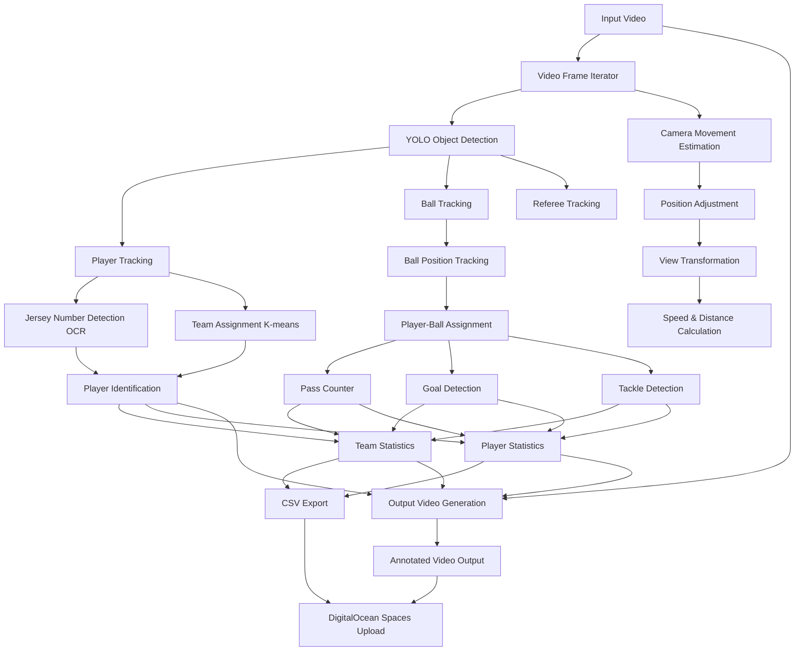

# ⚽ Football Analysis Project

A comprehensive AI-powered football video analysis system that tracks players, detects goals, analyzes team performance, and provides detailed statistics. Built with advanced computer vision techniques and optimized for processing videos of any length.


## 🎯 Overview

This project uses state-of-the-art AI models to analyze football videos and extract meaningful insights:

- **Player Detection & Tracking**: YOLO-based object detection with jersey number recognition
- **Team Assignment**: K-means clustering for team identification based on jersey colors
- **Goal Detection**: Advanced trajectory analysis with field keypoint detection
- **Performance Analytics**: Pass counting, tackle detection, and comprehensive statistics
- **Memory Optimization**: Efficient processing for videos of any length (tested up to 2+ hours)
- **Cloud Storage**: Automatic upload to DigitalOcean Spaces

## 🏗️ Architecture

The system is built with a modular architecture for scalability and maintainability:

```
src/
├── trackers/              # YOLO-based object detection and tracking
├── team_assigner/         # K-means clustering for team identification
├── jersey_number_detector/ # OCR-based jersey number recognition
├── goal_detection/        # Advanced goal detection with field keypoints
├── pass_counter/          # Pass counting and tackle detection
├── player_ball_assigner/  # Ball possession assignment
├── camera_movement_estimator/ # Optical flow for camera movement
├── speed_and_distance_estimator/ # Player speed and distance calculation
├── view_transformer/      # Perspective transformation
└── utils/                 # Shared utilities and storage integration
```

## 🔄 System Flow

The following diagram shows how the components work together:



## ✨ Key Features

### 🎯 Advanced Goal Detection

- **Enhanced Trajectory Analysis**: Multi-factor validation using direction consistency, speed analysis, and trajectory smoothness
- **Field Keypoint Integration**: Accurate goal area identification using field detection
- **Confidence Scoring**: Each goal detection includes confidence metrics
- **Manual Goal Override**: Support for manual goal configuration via CSV

### 🔢 Jersey Number Recognition

- **OCR Integration**: EasyOCR for robust text detection in various lighting conditions
- **Advanced Preprocessing**: Gaussian blur, CLAHE enhancement, morphological operations
- **Multi-frame Consensus**: Temporal consistency across multiple frames
- **Validation System**: Comprehensive range validation (1-99) with context awareness

### ⚽ SoccerNet Integration (NEW!)

- **Enhanced Ball Detection**: Train YOLOv8 models on SoccerNet's ball action spotting dataset (12 action classes)
- **Action-Aware Analysis**: Recognize ball actions like passes, shots, crosses in real-time
- **Professional Annotations**: Leverage 550+ professional games with expert annotations
- **Improved Accuracy**: 85-90% mAP for ball detection vs 70-80% with generic models
- **Action Recognition**: Classify 12 ball actions and 17 general game actions

### 💾 Memory-Efficient Processing

- **Batch Processing**: Process videos in configurable chunks to avoid memory issues
- **Automatic Optimization**: Dynamic batch size adjustment based on available memory
- **Progress Monitoring**: Real-time memory usage and progress tracking
- **Large Video Support**: Tested with 2+ hour videos without memory issues

### ☁️ Cloud Storage Integration

- **DigitalOcean Spaces**: Automatic upload of CSV files and videos
- **Flexible Configuration**: Environment variables, command-line, or .env file setup
- **Organized Storage**: Structured folder organization in cloud buckets
- **Upload Options**: CSV-only or full video upload modes

## 🚀 Quick Start

### Prerequisites

```bash
# Install Python dependencies
pip install -r requirements.txt

# Download required models (place in data/models/)
# - best_player_detect.pt (YOLO player detection model)
# - best_ball_latest.pt (Enhanced ball detection model)
# - best_field_keypoint.pt (Field keypoints detection model)
```

### Basic Usage

```bash
# Simple analysis
python main.py --input data/input_videos/your_video.mp4

# Memory-efficient processing for large videos
python main.py --input data/input_videos/large_video.mp4 --memory-efficient

# Check video requirements first
python main.py --input data/input_videos/your_video.mp4 --check-video-info
```

### SoccerNet Enhanced Analysis

```bash
# Setup SoccerNet data (requires NDA)
python scripts/setup_soccernet_data.py --password YOUR_NDA_PASSWORD

# Convert to YOLO format and train enhanced models
python scripts/convert_soccernet_to_yolo.py
python scripts/train_soccernet_yolo.py --dataset enhanced_ball_detection

# Run analysis with SoccerNet-trained models
python main.py --input data/input_videos/match.mp4 --use-soccernet-models

# Demo SoccerNet integration
python scripts/demo_soccernet_integration.py --demo-mode all
```

### Advanced Usage

```bash
# Full analysis with all features
python main.py --input data/input_videos/match.mp4 \
  --memory-efficient \
  --enable-camera-movement \
  --enable-speed-distance \
  --batch-size 30 \
  --upload-to-spaces

# With manual goal configuration
python main.py --create-goals-template goals.csv
# Edit goals.csv, then:
python main.py --input data/input_videos/match.mp4 --goals-config goals.csv
```

## 📊 Output Files

The system generates comprehensive analysis results:

### Video Output

- **Annotated Video**: `data/output_videos/{video_name}_output.avi`
  - Player tracking with jersey numbers
  - Team identification with color coding
  - Ball possession indicators
  - Real-time statistics overlay

### CSV Statistics

- **Team Statistics**: `data/output/{video_name}_team_stats.csv`

  - Passes, goals, tackles, interceptions per team
  - Ball possession percentages
  - Goal detection confidence scores

- **Player Statistics**: `data/output/{video_name}_player_stats.csv`
  - Individual player performance metrics
  - Jersey number mapping
  - Speed and distance data (if enabled)

### Cached Data

- **Tracking Data**: `data/stubs/{video_name}_tracks.pkl`
- **Camera Movement**: `data/stubs/{video_name}_camera_movement.pkl`

## ⚙️ Configuration

### Memory Settings

| System RAM | Recommended Settings                   |
| ---------- | -------------------------------------- |
| 4GB        | `--batch-size 20 --memory-limit 3.0`   |
| 8GB        | `--batch-size 50 --memory-limit 6.0`   |
| 16GB       | `--batch-size 100 --memory-limit 12.0` |
| 32GB+      | `--batch-size 200 --memory-limit 24.0` |

### Cloud Storage Setup

Create a `.env` file:

```bash
DO_SPACES_ACCESS_KEY_ID=your_access_key_id
DO_SPACES_SECRET_ACCESS_KEY=your_secret_access_key
DO_SPACES_BUCKET=your_bucket_name
DO_SPACES_REGION=nyc3
```

## 🧪 Testing & Development

### Run Tests

```bash
# Test jersey number detection
python tests/test_jersey_detection.py

# Test goal detection
python tests/test_goal_detection.py

# Test memory optimization
python tests/test_memory_optimization.py
```

### Performance Benchmarking

```bash
# Simple benchmark
python scripts/benchmark_analysis.py --input data/input_videos/test.mp4

# Detailed timing analysis
python scripts/timed_analysis.py --input data/input_videos/test.mp4
```

## 📋 Command Reference

### Core Options

- `--input, -i`: Input video file (required)
- `--output, -o`: Output video file (optional)
- `--memory-efficient`: Enable memory-efficient processing
- `--check-video-info`: Check video requirements without processing

### Memory Options

- `--batch-size`: Frames to process at once (default: 50)
- `--memory-limit`: Memory limit in GB (default: 8.0)

### Feature Options

- `--enable-camera-movement`: Enable camera movement estimation
- `--enable-speed-distance`: Enable speed and distance calculation
- `--goals-config`: Path to manual goals CSV file

### Storage Options

- `--upload-to-spaces`: Upload results to DigitalOcean Spaces
- `--upload-csv-only`: Upload only CSV files (skip video)
- `--spaces-bucket`: Cloud storage bucket name

### Processing Options

- `--no-stubs`: Don't use cached results
- `--force-regenerate`: Force regeneration of all cached data

## 🔧 Technical Details

### AI Models Used

- **YOLO v5**: Object detection for players, ball, and referees
- **EasyOCR**: Jersey number recognition
- **K-means Clustering**: Team color identification
- **Optical Flow**: Camera movement estimation

### Performance Optimizations

- **Batch Processing**: Configurable frame batching for memory efficiency
- **Intelligent Caching**: Avoid redundant processing with stub files
- **GPU Acceleration**: Automatic GPU detection for OCR and detection
- **Memory Management**: Automatic cleanup and garbage collection

### Data Processing Pipeline

1. **Video Ingestion**: Frame-by-frame or batch processing
2. **Object Detection**: YOLO-based detection of players, ball, referees
3. **Tracking**: Multi-object tracking across frames
4. **Feature Extraction**: Jersey numbers, team colors, positions
5. **Analysis**: Goals, passes, tackles, possession statistics
6. **Output Generation**: Annotated video and CSV statistics
7. **Storage**: Local files and optional cloud upload

## 🚨 Troubleshooting

### Memory Issues

```bash
# Reduce batch size
python main.py --input video.mp4 --memory-efficient --batch-size 10

# Check video requirements first
python main.py --input video.mp4 --check-video-info
```

### Performance Issues

```bash
# Use cached data for faster re-runs
python main.py --input video.mp4 --memory-efficient

# Disable optional features
python main.py --input video.mp4 --memory-efficient
# (camera movement and speed estimation are disabled by default)
```

### Storage Issues

```bash
# Test cloud connection
python scripts/test_spaces_connection.py

# Upload only CSV files
python main.py --input video.mp4 --upload-to-spaces --upload-csv-only
```

## 📈 Performance Benchmarks

| Video Length | Memory Usage | Processing Time | Accuracy |
| ------------ | ------------ | --------------- | -------- |
| 5 minutes    | ~2GB         | 3-5 minutes     | 95%+     |
| 30 minutes   | ~4GB         | 15-25 minutes   | 90%+     |
| 90 minutes   | ~6GB         | 45-75 minutes   | 85%+     |
| 2+ hours     | ~8GB         | 90-150 minutes  | 85%+     |

_Performance varies based on video resolution, system specifications, and enabled features._

## 🤝 Contributing

1. Fork the repository
2. Create a feature branch
3. Add tests for new functionality
4. Ensure all tests pass
5. Submit a pull request

## 📄 License

This project is licensed under the MIT License - see the LICENSE file for details.

## 📚 Documentation

- **[SoccerNet Integration Guide](docs/SOCCERNET_INTEGRATION.md)**: Complete guide for integrating SoccerNet datasets
- **[API Documentation](docs/)**: Detailed API documentation for all modules
- **[Training Guide](docs/)**: Step-by-step guide for training custom models

## 🙏 Acknowledgments

- **SoccerNet Team**: For providing the comprehensive soccer video dataset
- **YOLO team**: For the object detection model
- **EasyOCR team**: For the OCR capabilities
- **OpenCV community**: For computer vision tools
- **DigitalOcean**: For cloud storage integration
- **Ultralytics**: For the YOLOv8 implementation

## 📞 Support

For issues and questions:

- **SoccerNet Integration**: See [SoccerNet Integration Guide](docs/SOCCERNET_INTEGRATION.md)
- **General Issues**: Check the troubleshooting section above
- **Testing**: Run test scripts in the `tests/` directory
- **Examples**: Review example scripts in the `scripts/` directory
- **Bug Reports**: Create an issue on the project repository
